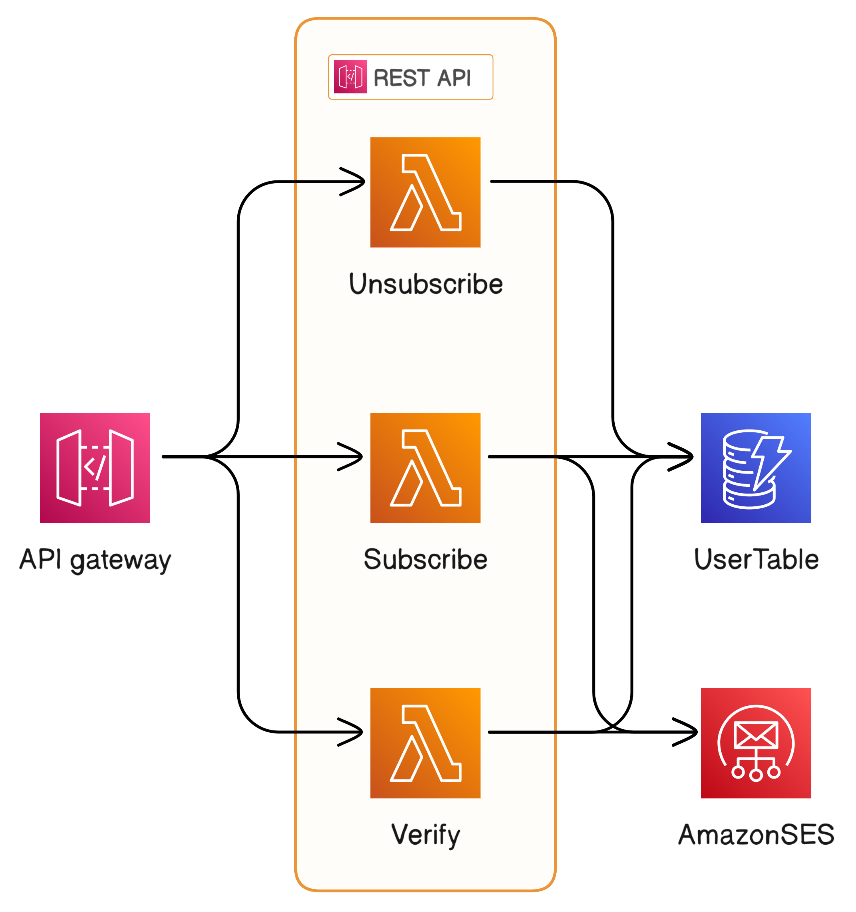

# MailBlog

MailBlog is a serverless application designed to streamline blog subscriptions and newsletter distribution

This Serverless application implements a simple Newsletter subscription service. It allows users to subscribe to a newsletter and receive a confirmation email. It follows the opt-in model, where users have to confirm their subscription before they can receive the newsletter.

Currently, the application is designed to handle

    - /subscribe
    - /verify
    - /unsubscribe

## Endpoints

### /subscribe

This endpoint allows users to subscribe to the newsletter. It expects a JSON payload with the following structure:

Method: POST

```json
{
  "email": "email@email.com"
}
```

Response:

```json
{
  "message": "Subscription successful | Error message"
}
```

this endpoint will also send a confirmation email to the user's email address. The email will contain a link to the /verify endpoint.

### /verify

This endpoint allows users to verify their subscription. It expects `email` and `token` as query parameters.

Method: GET

```
https://chapimenge.com/verify?email=email%40email.com&token=token
```

Response:

```json
{
  "message": "Subscription verified | Error message"
}
```

this endpoint will also send a welcome email to the user's email address.

### /unsubscribe

This endpoint allows users to unsubscribe from the newsletter. It expects `email` and `token` as query parameters.

Method: GET

```
https://chapimenge.com/unsubscribe?email=email@email.com&token=token
```

Response:

```json
{
  "message": "Subscription cancelled | Error message"
}
```

## Architecture

The design of the application is based on the following diagram:



The application is composed of the following components:

- API Gateway: This component exposes the endpoints to the internet. It is configured to use a custom domain name.
- Lambda: This component implements the business logic of the application. It is written in Python and uses the Serverless Application Model (SAM) to deploy the application.
- DynamoDB: This component stores the subscription information. It is configured to use on-demand capacity.
- SES: This component is used to send emails to the users. It is configured to use a custom domain name.

**Note:** You have to request production access to SES to be able to send emails to non-verified email addresses. You can request production access by going over the [SES console](https://console.aws.amazon.com/ses/home?region=us-east-1#dashboard:).

## Deployment

The application is deployed using the Serverless Application Model (SAM). To deploy the application, you need to have the AWS CLI installed and configured. You can find instructions on how to install and configure the AWS CLI [here](https://docs.aws.amazon.com/cli/latest/userguide/cli-chap-install.html).

Once you have the AWS CLI installed and configured, you can deploy the application by running the following command:

```bash
sam build && sam deploy
```

if you want change any parameters, you can do so by editing the `samconfig.toml` file.

## Testing

Coming soon...

## License

This project is licensed under the MIT License - see the [LICENSE](LICENSE) file for details.

you can use this project as a template for your own projects. If you do, please consider giving this project a star and/or a fork. It will help me a lot.

## Contributing

If you wish to contribute to this project, please follow the below simple steps:

1. Fork the project
2. Create a new branch (`git checkout -b new-branch`)
3. Commit your changes (`git commit -m "add new feature"`)
4. Push to the branch (`git push origin new-branch`)
5. Open a pull request
6. explain your changes in the pull request description. If you are adding a new feature, please explain how to use it.
7. I will review your changes and merge them if they are good to go.

## Author

- **Temkin Mengsitu** - _Initial work_ - [Temkin Mengsitu](https://chapimenge.com)
